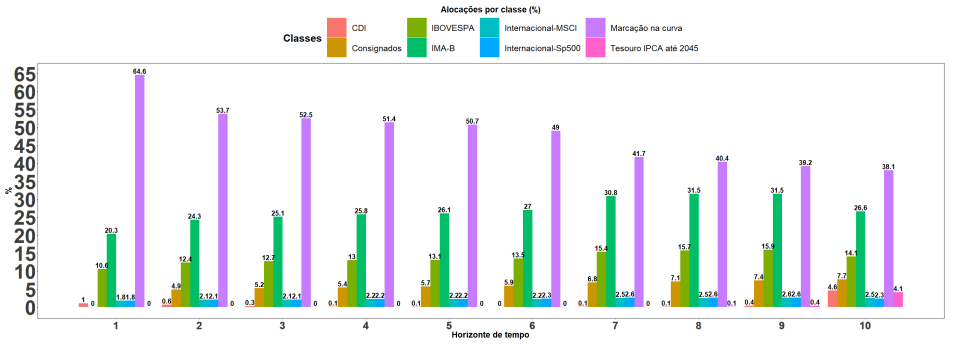
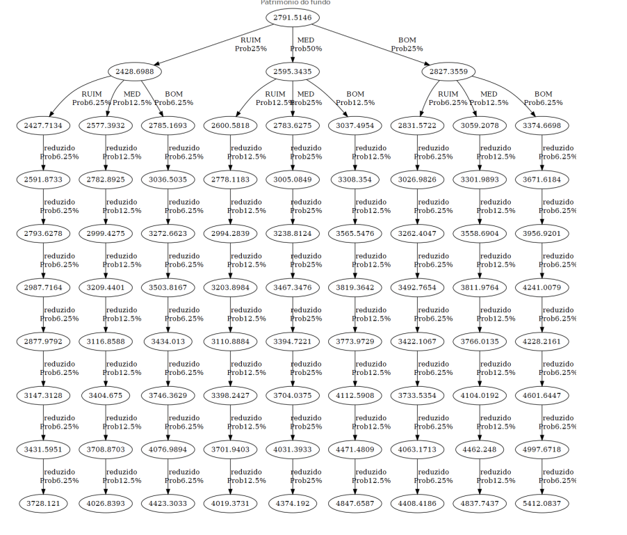

---
pdf_document:
  fig_caption: true
  number_sections: true
  dev: png
subtitle: 'Relatório de Análise de Dados utilizando Extreme Value Theory (EVT) para Sinistros de Incêndio'
title: 'Análise de Variáveis de Perda - Segundo Exercício Escolar'
author: Felipe Pereira$^1$,
        Gabriel D’assumpção de Carvalho$^2$,
        Georgio Kokkosis De Freitas$^3$ 
date: \today 
output:
  bookdown::pdf_document2:
    number_sections: true
    toc: true
    toc_depth: 2
  pdf_document: default
  html_document:
    toc: true
    toc_depth: '2'
    df_print: paged
params:
  digits: 4
header-includes: |
  \usepackage{amsmath}
  \usepackage{fancyhdr}
  \usepackage{authblk}
  \renewcommand\Authfont{\normalsize}
  \renewcommand\Affilfont{\itshape\small}
  \setlength{\affilsep}{-0.5em}  % Adjust spacing between author and affiliation
  \date{February 28, 2025}
  \pagestyle{fancy}
  \fancyhead[L]{Análise de Variáveis de Perda}
  \fancyfoot[C]{Página \thepage}
  \fancyhead[C]{}
---

\newpage

# Lista de Artigos

A seguir, apresenta-se uma seleção de três artigos científicos com temas relevantes à gestão de ativos e passivos em fundos de pensão, análise de sobrevivência aplicada à mortalidade de participantes e mitigação de perdas em seguros contra incêndios florestais.

------------------------------------------------------------------------

## **Gestão de Ativos e Passivos em Fundos de Pensão**

-   **Título:** *A Study of Asset and Liability Management Applied to Brazilian Pension Funds*\
-   **Revista:** [European Journal of Operational Research](https://www.scimagojr.com/journalsearch.php?q=22489&tip=sid&clean=0)\
-   **Link do artigo:** [ScienceDirect](https://www.sciencedirect.com/science/article/abs/pii/S0377221724008816)\
-   **Autores:** Wilton Bernardino, Rodrigo Falcão, João Jr., Raydonal Ospina, Filipe Costa de Souza, José Jonas Alves Correia\
-   **Resumo:** O artigo propõe um modelo de gestão de ativos e passivos (ALM) voltado para fundos de pensão brasileiros, utilizando dados nacionais. O objetivo é assegurar que os fundos possuam ativos suficientes para cumprir com os pagamentos futuros de aposentadorias, ao mesmo tempo em que gerenciam riscos de investimento de maneira eficiente.

------------------------------------------------------------------------

## **Análise de Sobrevivência com Dados Incompletos em Fundos de Pensão**

-   **Título:** *Survival Analysis of Pension Scheme Mortality When Data Are Missing*\
-   **Revista:** [Scandinavian Actuarial Journal](https://www.scimagojr.com/journalsearch.php?q=20043&tip=sid&clean=0)\
-   **Link do artigo:** [Research Portal - Heriot-Watt University](https://researchportal.hw.ac.uk/en/publications/survival-analysis-of-pension-scheme-mortality-when-data-are-missi)\
-   **Autores:** Francesco Ungolo, Marcus C. Christiansen, Torsten Kleinow, Angus S. Macdonald\
-   **Resumo:** O estudo trata dos desafios enfrentados ao modelar a mortalidade de participantes de fundos de pensão na presença de dados ausentes. São utilizados modelos paramétricos de sobrevivência para estimar as taxas de mortalidade e avaliar os impactos financeiros decorrentes da incerteza nos dados.

------------------------------------------------------------------------

## **Mitigação de Perdas de Incêndios Florestais via Títulos Ligados a Seguros**

-   **Título:** *Mitigating Wildfire Losses via Insurance‐Linked Securities: Modeling and Risk Management Perspectives*\
-   **Revista:** [Journal of Risk and Insurance](https://www.scimagojr.com/journalsearch.php?q=18617&tip=sid&clean=0)\
-   **Link do artigo:** [Wiley Online Library](https://onlinelibrary.wiley.com/doi/10.1111/jori.12449)\
-   **Autores:** Yuanyuan Li, Nan Liu, Howard Kunreuther\
-   **Resumo:** Este artigo propõe uma estrutura estatística baseada em modelos bayesianos de espaço de estados dinâmicos para prever perdas decorrentes de incêndios florestais. A proposta visa contribuir para o desenvolvimento de títulos vinculados a seguros (ILS), permitindo uma gestão de riscos mais eficiente por parte das seguradoras.

------------------------------------------------------------------------

# Gestão de Ativos e Passivos em Fundos de Pensão

O artigo [**Gestão de Ativos e Passivos em Fundos de Pensão**](https://www.sciencedirect.com/science/article/abs/pii/S0377221724008816), publicado na *European Journal of Operational Research*, apresenta um estudo sobre a aplicação de técnicas de Asset and Liability Management (ALM) a fundos de pensão brasileiros. A ALM é fundamental para garantir que esses fundos mantenham ativos suficientes para cobrir seus passivos futuros (como pagamentos de aposentadorias), ao mesmo tempo que gerenciam adequadamente os riscos de investimento.

O sistema previdenciário brasileiro baseia-se em três pilares: o Regime Geral de Previdência Social (RGPS), o Regime Próprio de Previdência Social (RPPS) e o Regime de Previdência Complementar (RPC). O RPC é operado por Entidades Fechadas e Abertas de Previdência Complementar (EFPC), sendo comumente adotado como complemento à aposentadoria oficial oferecida pelos dois primeiros regimes.

Neste estudo, os autores propõem um modelo de ALM que visa minimizar as contribuições esperadas feitas pelos indivíduos durante sua vida ativa, respeitando restrições regulatórias e de fluxo de caixa. A função objetivo utiliza uma abordagem robusta de otimização min-max, com base em três cenários para a taxa CDI (Alta, Média e Baixa). O modelo é enriquecido por técnicas de aprendizado de máquina, como o CMARS (Conic Multivariate Adaptive Regression Splines), para prever intervalos de confiança dos principais parâmetros estocásticos relacionados aos retornos de ativos no mercado brasileiro. Toda a modelagem foi implementada utilizando o software GAMS.

A base de dados contempla séries de retorno de sete ativos representativos do mercado (CDI, IPCA, IMA-B, Título IPCA de longo prazo, IBOVESPA, S&P 500 e MSCI) no período de 2000 a 2022. Tábuas de vida da SUSEP foram utilizadas para simulações atuariais, além de dados do fundo RPPS Reciprev (2022), utilizados para uma aplicação empírica.

O modelo adota uma árvore de eventos para geração de cenários e calcula medidas de risco como Value-at-Risk (VaR), Conditional Value-at-Risk (CVaR) e risco de baixa. Perfis de gestores conservadores e agressivos são comparados quanto às alocações ideais de portfólio ao longo de um horizonte de 10 anos. Os resultados indicam que perfis mais arrojados tendem a alocar mais em ações (IBOVESPA), assumindo maior risco de baixa, porém mantendo custos médios de contribuição similares aos perfis conservadores. Já em cenários extremos de CDI, os gestores conservadores tendem a apresentar desempenho superior.

No estudo de caso da RPPS Reciprev, o modelo é aplicado a dados reais do fundo, considerando novas classes de ativos como títulos baseados em curvas Price-Yield e empréstimos entre participantes. Os resultados destacam alocações ideais, fluxos de caixa, e projeções de retorno e índice de financiamento em diferentes cenários. A distribuição dos retornos acumulados apresenta assimetria positiva, e a estratégia proposta contribui para reduzir o risco de baixa com uma taxa de contribuição inferior à observada nos dados reais de 2022.

O artigo também realiza uma revisão da literatura sobre ALM, ressaltando a escassez de estudos focados na modelagem matemática desses problemas no contexto brasileiro. Os autores recomendam que estudos futuros incorporem casos contínuos e estocásticos, restrições de cauda baseadas em CVaR, bem como modelos de seleção e agendamento de projetos no portfólio.

Como desdobramento prático, o modelo desenvolvido foi incorporado ao aplicativo web da Reciprev, ferramenta que integra funcionalidades como ALM, cálculo de VaR, backtesting, análise de carteiras via Markowitz, entre outras métricas financeiras, oferecendo suporte à tomada de decisão por gestores previdenciários.

Fonte complementar: [taisparanhos.com.br](https://www.taisparanhos.com.br/2024/12/pesquisadores-do-convenio-ufpe-reciprev.html)

## Relatório ALM (RPPS Reciprev)

Abaixo estão alguns destaques do Relatório ALM elaborado pela Reciprev para o ano de 2023:\
<https://reciprev.recife.pe.gov.br/sites/default/files/inline-files/Relatorio_ALM_29_assinado-assinado_2.pdf>

Como ocorre com todo fundo de pensão, os ativos investidos devem estar sujeitos a um risco controlado. Para isso, são estipuladas políticas de investimento que definem limites para cada tipo de ativo. No caso da Reciprev, as restrições são as seguintes:

| Classe de Investimento | Limite Inferior | Limite Superior |
|------------------------|-----------------|-----------------|
| CDI                    | 0%              | 25%             |
| IMA-B                  | 0%              | 100%            |
| Tesouro IPCA até 2045  | 0%              | 100%            |
| IBOVESPA               | 0%              | 30%             |
| S&P 500                | 0%              | 5%              |
| MSCI                   | 0%              | 5%              |

**Tabela 1**: Política de investimentos da Reciprev em 2023.

Como podemos observar, os ativos de renda fixa e os ativos nacionais possuem maior margem de alocação. Por isso, a modelagem do ALM considera diferentes cenários relacionados ao comportamento do CDI. A seguir, apresentamos uma tabela qualitativa que descreve a correlação entre o CDI e os demais índices em cenários de alta e baixa do CDI.

| Índice                | CDI em Alta | CDI em Baixa |
|-----------------------|-------------|--------------|
| IPCA                  | Alta        | Baixa        |
| IMA-B                 | Baixa       | Alta         |
| Tesouro IPCA até 2045 | Alta        | Baixa        |
| IBOVESPA              | Baixa       | Alta         |
| S&P 500               | Baixa       | Alta         |
| MSCI                  | Baixa       | Alta         |

**Tabela 2**: Descrição qualitativa da sensibilidade dos índices em relação ao CDI.

Com base nessas relações, foram definidos retornos reais estimados para cada classe de ativo, utilizando dados históricos de 2000 a 2021. Os valores são baseados nas medianas dos seguintes intervalos de quantis: 0%-25% (CDI em alta), 25%-75% (CDI mediano) e 75%-100% (CDI em baixa), todos corrigidos pelo IPCA.

| Classe/Cenário        | CDI em Alta | CDI Mediano | CDI em Baixa |
|-----------------------|-------------|-------------|--------------|
| CDI                   | 7,89%       | 5,59%       | 3,46%        |
| IMA-B                 | -2,23%      | 7,05%       | 13,21%       |
| Tesouro IPCA até 2045 | 7,39%       | 5,94%       | 3,97%        |
| IBOVESPA              | -27,27%     | 5,10%       | 59,98%       |
| S&P 500               | -18,85%     | 6,46%       | 42,16%       |
| MSCI                  | -16,32%     | 1,63%       | 38,48%       |

**Tabela 3**: Retornos reais (anuais) estimados por classe de investimento, conforme os quantis de retorno do CDI.

Com esses dados em mãos, a modelagem do ALM foi estruturada como uma otimização min-max. O objetivo é minimizar a alíquota de contribuição considerando o pior cenário, ao mesmo tempo em que se busca maximizar o patrimônio líquido esperado ao longo do tempo.

Como mostrado no gráfico acima, a alocação de maior destaque é a do CDI, iniciando com 64,6% e reduzindo-se gradualmente para 38,1% ao final do horizonte de 10 anos. O IMA-B surge como o segundo ativo mais relevante, começando com 20,3% e aumentando para 26,6%. O IBOVESPA inicia com 10,6% e sobe para 14,1%. Já os consignados passam a integrar a carteira a partir do segundo ano com 4,9%, encerrando o período com 7,7%.

{width="352"}

A figura acima mostra a evolução do patrimônio líquido (PL) ao longo de 10 períodos para os cenários pessimista, mediano e otimista. Mesmo no pior cenário, o PL inicial de R\$ 2,79 bilhões cresce para R\$ 3,73 bilhões após 10 anos. No melhor cenário, o fundo pode alcançar R\$ 5,41 bilhões.

Com isso, a árvore de evolução do ALM proporciona uma visão abrangente sobre o comportamento do patrimônio do fundo em diferentes cenários macroeconômicos.

Para uma melhor visão dessa alocação otima, podemos ver a evolução do patrimônio líquido no horizonde de 10 tempos estando no pior cenario, cenario médio e o melhor cenario. Podemos ver que sempre vamos ter o pior cenário, o patrimonio líquido começa em 2.79 bilhões e termina no tempo 10 com 3.73 bilhões, considerando sempre o melhor cenario vamos terminar com um patrimonio líquido de 5.41 bilhões.

Com isso podemos ver que a arvore de evolução ALM da uma visão bem ampla sobre o patrimonio líquido do fundo para cada tipo de cenário.
