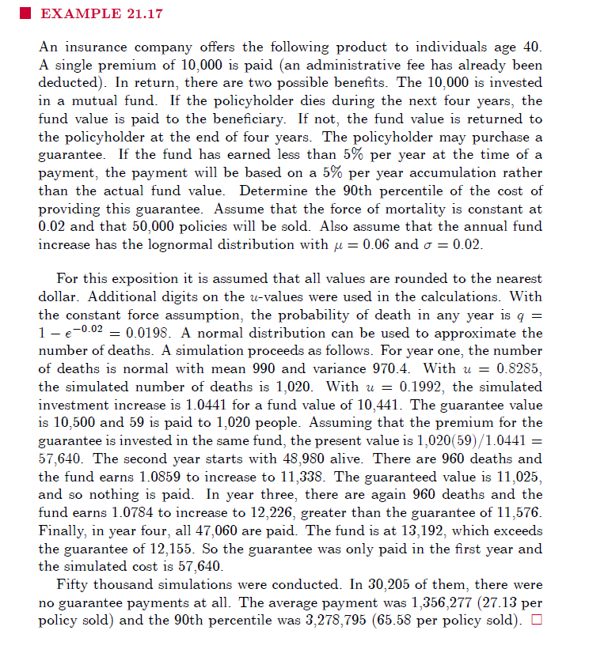

---
pdf_document:
  fig_caption: true
  number_sections: true
  dev: png
subtitle: '4º Questão'
title: 'Análise de Variáveis de Perda - Segundo Exercício Escolar'
author: Felipe Pereira$^1$,
        Gabriel D’assumpção de Carvalho$^2$,
        Georgio Kokkosis De Freitas$^3$ 
date: \today 
output:
  bookdown::pdf_document2:
    number_sections: true
    toc: true
    toc_depth: 2
  pdf_document: default
  html_document:
    toc: true
    toc_depth: '2'
    df_print: paged
params:
  digits: 4
header-includes: |
  \usepackage{amsmath}
  \usepackage{fancyhdr}
  \usepackage{authblk}
  \renewcommand\Authfont{\normalsize}
  \renewcommand\Affilfont{\itshape\small}
  \setlength{\affilsep}{-0.5em}  % Adjust spacing between author and affiliation
  \date{February 28, 2025}
  \pagestyle{fancy}
  \fancyhead[L]{Análise de Variáveis de Perda}
  \fancyfoot[C]{Página \thepage}
  \fancyhead[C]{}
  % Removed: \setlength{\authorsep}{0em}  <- NOT needed/supported here
---

\newpage

# 4º Questão

Suponha uma variável aleatória $\Lambda>0$ e defina a função taxa de risco condicional (dado $\Lambda=\lambda$) de $X$ como $h_{X|\Lambda}(x|\lambda)=\lambda \cdot a(x)$, em que $a(x)$ representa uma \`fragilidade' que busca mensurar incertezas associadas à função taxa de risco e que são incorporadas com base na experiência do analista atuarial.

1.  De forma geral, descreva a função de sobreviência condicional $S_{X|\Lambda}(x|\lambda)$ considerando a abordagem enunciada acima.
2.  Ilustre exemplos para escolhas de estruturas de fragilidade nesse tipo de modelagem.
3.  Utilizando-se de simulações, replique o \`EXAMPLE 21.17' descrito abaixo:

## 1º Resposta

Sabemos que a função de risco é dada por:

$$
h(x) = \frac{f(x)}{S(x)} = \frac{-S'(x)}{S(x)} = -\frac{d}{dx} \log S(x)
$$

Ao integrar $h(x)$, recuperamos $\log S(x)$, e aplicando a exponencial, obtemos a função de sobrevivência:

$$
S(x) = e^{-\int_{0}^{x} h(t)dt}
$$

Portanto, considerando a taxa de risco condicional dada no enunciado:

$$
h_{X|\Lambda}(x|\lambda) = \lambda \cdot a(x)
$$

Substituímos na equação acima:

$$
S_{X|\Lambda}(x|\lambda) = \exp\left(-\int_{0}^{x} h_{X|\Lambda}(t|\lambda) dt\right) = \exp\left(-\lambda \int_{0}^{x} a(t) dt\right)
$$

Definindo a integral da fragilidade como:

$$
A(x) = \int_{0}^{x} a(t) dt
$$

A função de sobrevivência condicional pode ser reescrita de forma mais compacta como:

$$
S_{X|\Lambda}(x|\lambda) = \exp(-\lambda A(x))
$$

Essa formulação evidencia que a função de sobrevivência condicional depende diretamente da fragilidade acumulada até $x$, ponderada pelo parâmetro $\lambda$, que governa a incerteza na taxa de risco.

Abaixo, ilustramos alguns exemplos para a escolha da fragilidade.

## 2º Resposta

### Estrutura com Risco Constante

Supondo que a escolha de $a(x) = c$, onde $$c>0$$ é uma constante qualquer, temos:

$$
A(x) = \int_{0}^{x}c \,dx = c \cdot x
$$

Portanto, a função de sobrevivência será dada por:

$$
S_{X|\Lambda}(x|\lambda) = \exp(-\lambda \cdot c \cdot x)
$$

Como podemos observar, a variável $X$ segue uma distribuição exponencial com taxa $\lambda \cdot c$. Assim, a fragilidade $\lambda$ atua apenas como um fator de escala sobre uma taxa de risco constante.

### Estrutura com Risco Weibull

A modelagem com a distribuição Weibull é amplamente utilizada na análise de sobrevivência devido à sua flexibilidade, permitindo modelar riscos que podem diminuir, aumentar ou permanecer constantes ao longo do tempo, dependendo da escolha dos seus parâmetros. A função de risco da distribuição Weibull é dada por:

$$
h(x) = \frac{\beta}{\eta} \cdot \left(\frac{x}{\eta}\right)^{\beta - 1}
$$

Assim, temos as seguintes interpretações:

-   $\beta > 1 \Rightarrow$ $h(x)$ aumenta ao longo de $x$, sendo útil para modelar situações de desgaste ou envelhecimento, onde o risco tende a crescer com o tempo.
-   $\beta < 1 \Rightarrow$ $h(x)$ diminui ao longo de $x$, sendo aplicável em cenários como mortalidade infantil ou falhas de foguetes, onde o risco inicial é elevado, mas a sobrevivência melhora após o tempo inicial.
-   $\beta = 1 \Rightarrow$ $h(x) = \frac{1}{\eta}$, implicando um risco constante, adequado para modelagem em processos como teoria de filas.

Agora, podemos modelar a fragilidade com a distribuição Weibull:

$$
a(x) = \frac{\beta}{\eta} \cdot \left(\frac{x}{\eta}\right)^{\beta - 1}
$$

A integral acumulada da fragilidade resulta em:

$$
A(x) = \int_{0}^{x}a(t)dt = \int_{0}^{x} \frac{\beta}{\eta} \cdot \left(\frac{t}{\eta}\right)^{\beta - 1} dt
$$

Reescrevendo:

$$
A(x) = \frac{\beta}{\eta^\beta} \int_{0}^{x} t^{\beta - 1} dt
$$

Resolvendo a integral:

$$
A(x) = \frac{\beta}{\eta^\beta} \left[\frac{t^\beta}{\beta}\right]_{0}^{x} = \left(\frac{x}{\eta}\right)^\beta
$$

Assim, a função de sobrevivência condicional será:

$$
S_{X|\Lambda}(x|\lambda) = \exp\left(-\lambda \left(\frac{x}{\eta}\right)^\beta\right)
$$

Sabemos que $\exp(-\infty)$ tende a zero, indicando que a probabilidade de sobrevivência diminui à medida que o risco acumulado da fragilidade aumenta.

## Simulação

A seguir vai ser feito uma simulação para o seguinte exemplo

{width="438"}

\newpage

```{r}
set.seed(42)

# Paremetros da simulação
initial_policies = 50000
premium = 10000
years = 4
force_mortality = 0.02
rate = 0.05
lognorm_mu = 0.06
lognorm_sigma = 0.02
q = 1 - exp(-force_mortality)

# Quantidade de simulação
n_sim = 50000

# Vetor que vai conter os valores do custo total
total_cost = numeric(n_sim)

for (sim in 1:n_sim){
  num_surv = initial_policies # Quantidade de segurados inicial
  value_policies = premium # Valor do prêmio inicial
  cumulative_cust_sim = 0 # Valor acumulado do custo 
  
  for (y in 1:years){
    guaranteed_value = premium * (1 + rate)^y # Valor de garantia de 5%
    # Retorno do fundo (lognormal)
    found_rate = rlnorm(1, meanlog = lognorm_mu, sdlog = lognorm_sigma) 
    found_value = value_policies * found_rate
    
   # Simulação de morte
    if (num_surv > 0){
      num_deaths = rbinom(1, size = num_surv, prob = q)
    }else{
      num_deaths = 0 
    }
    # Correção para não ter mais mortos do que pessoas vivas
    num_deaths = min(num_deaths, num_surv)
    
    # Calculando o custo por uma única morte
    cost_death = max(0, guaranteed_value - found_value)
    
    # Calculando o custo por todas as mortes
    cost_deaths = num_deaths * cost_death
    
    # Calculando o custo acumulado de cada simulação 
    cumulative_cust_sim = cumulative_cust_sim + cost_deaths
    
    # Atualização de pessoas vivas
    num_surv =  num_surv - num_deaths
    
    # Novo valor da apolice
    value_policies  = found_value
    
    if (y == years){
      if (num_surv > 0){
        cost_survivor = max(0, guaranteed_value - found_value)
        cost_survivors = cost_survivor * num_surv
        cumulative_cust_sim = cost_survivors + cumulative_cust_sim
      }
    }
    
  }
  total_cost[sim] = cumulative_cust_sim
}
```

### Resultado da Simulação

```{r}
avg_total_cost = mean(total_cost)
avg_cost_policy = avg_total_cost / initial_policies

p90_total_cost = quantile(total_cost, probs=0.9)
p90_cost_policy = p90_total_cost/initial_policies

cat("--- Resultado das ",n_sim," Simulação ---\n")
cat("Probabilidade de Morte (q):", format(q, digits=4), "\n")
cat("Custo Agregado Médio:", format(avg_total_cost, big.mark=",", scientific=FALSE, digits=2), "\n")
cat("Custo Agregado Médio por Apólice:", format(avg_cost_policy, digits=4), "\n")
cat("Quantil 90th do Custo Agregado:", format(p90_total_cost, big.mark=",", scientific=FALSE, digits=2), "\n")
cat("Quantil 90th do Custo Agregado por Apólice:", format(p90_cost_policy, digits=4), "\n")
```

Os resultados de 50.000 simulações, utilizando uma probabilidade anual de morte (q) de 0,0198, indicam que o custo médio total da garantia foi de \$1,601,689,00. Isso resulta em um custo médio por apólice inicial de \$32,03, um valor relativamente baixo.

Analisando o Value-at-Risk (VaR) a 90%, observa-se um custo total de \$3,980,430,00. Este valor representa o limite de custo que não é excedido em 90% dos cenários simulados.

Para aprofundar a análise do risco de cauda (tail risk), calcula-se o Tail Value-at-Risk (TVaR). Esta métrica corresponde ao custo médio esperado nos 10% piores cenários simulados. A comparação do TVaR com o valor inicial do fundo, que é de \$500 milhões (50.000 apólices \* \$10.000), permite dimensionar o impacto potencial desses cenários mais extremos sobre o capital inicial.

```{r}
tvar_90 = mean(total_cost[total_cost >= p90_total_cost])

cat("TVaR 90% do Custo Agregado:", format(tvar_90, big.mark=",", scientific=FALSE, digits=2), "\n")
```

Podemos ver que mesmo disconsiderando a rentabilidade do valor inicial de \$ 500 milhões de dólares, quando reduzimos desse valor a média dos 5000 maiores custo, o fundo ainda vai ter \$ 14,904,360.00 dólares.

A análise do Tail Value-at-Risk (TVaR) a 90%, que representa o custo médio esperado nos 10% piores cenários (as 5.000 simulações de maior custo), revela um valor de \$14,620,433.00.

É importante notar que, mesmo desconsiderando qualquer rentabilidade sobre o capital inicial de \$500 milhões, se subtrairmos este custo médio extremo (TVaR) do valor inicial, o fundo ainda reteria um montante substancial de \$485,095,640.00.

Este resultado demonstra a resiliência do fundo, indicando que, mesmo nos cenários mais adversos simulados, o impacto no capital inicial é limitado.

\newpage

# Referência

BERNARDINO, W. Aula 2: Variáveis aleatórias em atuária. [Material de ensino]. Disponível em: Ambiente Virtual de Aprendizagem da . Acesso em: 29 mar. 2025.

DISTRIBUIÇÃO de Weibull. In: WIKIPÉDIA, a enciclopédia livre. Disponível em: <https://pt.wikipedia.org/wiki/Distribuição_de_Weibull>. Acesso em: 29 mar. 2025.
